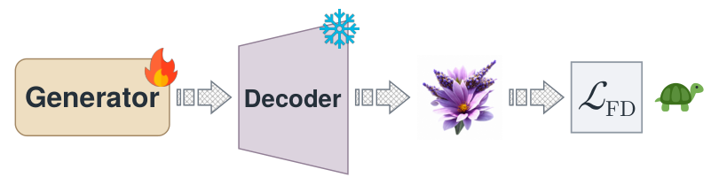

<div align="center">

# Efficient Fréchet Distributional Decoder Alignment

### for Latent Generative Models

[](docs/assets/FDDA.pdf)
[](https://sunset-clouds.github.io/Frechet-Distributional-Decoder-Alignment/)
[](https://sunset-clouds.github.io/Frechet-Distributional-Decoder-Alignment/assets/FDDA.pdf)
[](https://huggingface.co/jiajunzhu/Frechet-Distributional-Decoder-Alignment)

**[Xianghong Fang](https://sunset-clouds.github.io/)<sup>1,&#42;</sup> · Jiajun Zhu<sup>2,&#42;</sup> · Esma Aimeur<sup>2</sup> · Dehan Kong<sup>1</sup> · Tim G. J. Rudner<sup>1,3</sup>**

<sup>1</sup>University of Toronto &nbsp;&nbsp; <sup>2</sup>Université de Montréal &nbsp;&nbsp; <sup>3</sup>Vijil &nbsp;&nbsp; <sup>&#42;</sup>Equal contribution

</div>

> **TL;DR:** FDDA freezes the latent generator and aligns the decoder on generation-time latents with a Fréchet distributional objective. Across 11 models, one epoch reduces gFDr<sup>6</sup> by 34.0–59.6% from original checkpoints and by a further 10.2–57.2% after generator-side FD post-training, at 3.6–328.7× lower total training cost.

<p align="center">
  <a href="docs/assets/generator_side.pdf"></a>
  <a href="docs/assets/decoder_side.pdf"></a>
  <br>
  <big><big>Generator-side FD post-training (left) and decoder-side FDDA (right).</big></big>
</p>

## Overview

This repository contains the decoder weights and the PyTorch training and evaluation code of FDDA.
FDDA post-trains the tokenizer decoder of a latent generative model with a Fréchet distance (FD)
loss on generated samples, measured in pretrained representation spaces (SigLIP2, MAE,
Inception-v3). The generator, the tokenizer encoder and the quantizer stay frozen.

Supported models: LlamaGen, GigaTok, TiTok and VAR (discrete autoregressive) and iMF
(one-step flow matching). Each is supported with its pretrained generator and with its
generator-side FD post-trained version (FDAR for the autoregressive models, FD-SIM for iMF).

## Decoder weights

ImageNet 256x256, 50,000 generated samples. gFD<sub>r6</sub> is the mean over six
representation spaces (Inception-v3, ConvNeXt-v2, DINOv2, MAE, SigLIP2, CLIP) of FD divided by
the FD of the ImageNet validation set.
Each decoder is used with the generator named in `--generator_name`.

### Before generator-side FD post-training

Decoders adapted to the pretrained generators.

Model | decoder params | `--generator_name` | gFID | IS | gFD<sub>r6</sub> | weight
--- |:---:|:---:|:---:|:---:|:---:| ---
LlamaGen-B | 42.5M | `llamagen-B_256` | 2.74 | 209.3 | 10.88 | [`llamagen-B_256.pt`](https://huggingface.co/jiajunzhu/Frechet-Distributional-Decoder-Alignment/blob/main/before_generator_side/llamagen/llamagen-B_256.pt)
LlamaGen-L | 42.5M | `llamagen-L_256` | 1.87 | 303.5 | 5.60 | [`llamagen-L_256.pt`](https://huggingface.co/jiajunzhu/Frechet-Distributional-Decoder-Alignment/blob/main/before_generator_side/llamagen/llamagen-L_256.pt)
GigaTok-S-S | 83.8M | `gigatok-B_256` | 1.68 | 281.6 | 6.59 | [`gigatok-B_256.pt`](https://huggingface.co/jiajunzhu/Frechet-Distributional-Decoder-Alignment/blob/main/before_generator_side/gigatok/gigatok-B_256.pt)
TiTok-L-32 | 337.6M | `titok-L32` | 1.34 | 202.6 | 6.19 | [`titok-L32.pt`](https://huggingface.co/jiajunzhu/Frechet-Distributional-Decoder-Alignment/blob/main/before_generator_side/titok/titok-L32.pt)
TiTok-B-64 | 118.8M | `titok-B64` | 1.61 | 214.9 | 6.99 | [`titok-B64.pt`](https://huggingface.co/jiajunzhu/Frechet-Distributional-Decoder-Alignment/blob/main/before_generator_side/titok/titok-B64.pt)
VAR-d16 | 64.7M | `var-d16_256` | 1.62 | 280.1 | 7.03 | [`var-d16_256.pt`](https://huggingface.co/jiajunzhu/Frechet-Distributional-Decoder-Alignment/blob/main/before_generator_side/var/var-d16_256.pt)
VAR-d20 | 64.7M | `var-d20_256` | 1.32 | 296.9 | 5.34 | [`var-d20_256.pt`](https://huggingface.co/jiajunzhu/Frechet-Distributional-Decoder-Alignment/blob/main/before_generator_side/var/var-d20_256.pt)
VAR-d24 | 64.7M | `var-d24_256` | 1.24 | 304.4 | 4.26 | [`var-d24_256.pt`](https://huggingface.co/jiajunzhu/Frechet-Distributional-Decoder-Alignment/blob/main/before_generator_side/var/var-d24_256.pt)
iMF-B | 49.5M | `imf-B_256` | 1.65 | 268.1 | 8.54 | [`imf-B_256.pt`](https://huggingface.co/jiajunzhu/Frechet-Distributional-Decoder-Alignment/blob/main/before_generator_side/imf/imf-B_256.pt)
iMF-L | 49.5M | `imf-L_256` | 1.26 | 281.0 | 5.48 | [`imf-L_256.pt`](https://huggingface.co/jiajunzhu/Frechet-Distributional-Decoder-Alignment/blob/main/before_generator_side/imf/imf-L_256.pt)
iMF-XL | 49.5M | `imf-XL_256` | 1.14 | 288.3 | 5.03 | [`imf-XL_256.pt`](https://huggingface.co/jiajunzhu/Frechet-Distributional-Decoder-Alignment/blob/main/before_generator_side/imf/imf-XL_256.pt)

### After generator-side FD post-training

Decoders adapted to the FD post-trained generators (FDAR for LlamaGen, GigaTok, TiTok and VAR; FD-SIM for iMF).

Model | decoder params | `--generator_name` | gFID | IS | gFD<sub>r6</sub> | weight
--- |:---:|:---:|:---:|:---:|:---:| ---
LlamaGen-B | 42.5M | `llamagen-B_256-fdpt` | 2.23 | 275.9 | 5.27 | [`llamagen-B_256-fdpt.pt`](https://huggingface.co/jiajunzhu/Frechet-Distributional-Decoder-Alignment/blob/main/after_generator_side/llamagen/llamagen-B_256-fdpt.pt)
LlamaGen-L | 42.5M | `llamagen-L_256-fdpt` | 1.34 | 313.5 | 3.18 | [`llamagen-L_256-fdpt.pt`](https://huggingface.co/jiajunzhu/Frechet-Distributional-Decoder-Alignment/blob/main/after_generator_side/llamagen/llamagen-L_256-fdpt.pt)
GigaTok-S-S | 83.8M | `gigatok-B_256-fdpt` | 1.74 | 296.5 | 3.84 | [`gigatok-B_256-fdpt.pt`](https://huggingface.co/jiajunzhu/Frechet-Distributional-Decoder-Alignment/blob/main/after_generator_side/gigatok/gigatok-B_256-fdpt.pt)
TiTok-L-32 | 337.6M | `titok-L32-fdpt` | 1.35 | 215.1 | 5.49 | [`titok-L32-fdpt.pt`](https://huggingface.co/jiajunzhu/Frechet-Distributional-Decoder-Alignment/blob/main/after_generator_side/titok/titok-L32-fdpt.pt)
TiTok-B-64 | 118.8M | `titok-B64-fdpt` | 1.42 | 240.3 | 5.42 | [`titok-B64-fdpt.pt`](https://huggingface.co/jiajunzhu/Frechet-Distributional-Decoder-Alignment/blob/main/after_generator_side/titok/titok-B64-fdpt.pt)
VAR-d16 | 64.7M | `var-d16_256-fdpt` | 1.35 | 307.3 | 2.62 | [`var-d16_256-fdpt.pt`](https://huggingface.co/jiajunzhu/Frechet-Distributional-Decoder-Alignment/blob/main/after_generator_side/var/var-d16_256-fdpt.pt)
VAR-d20 | 64.7M | `var-d20_256-fdpt` | 1.08 | 308.1 | 1.98 | [`var-d20_256-fdpt.pt`](https://huggingface.co/jiajunzhu/Frechet-Distributional-Decoder-Alignment/blob/main/after_generator_side/var/var-d20_256-fdpt.pt)
VAR-d24 | 64.7M | `var-d24_256-fdpt` | 1.09 | 308.3 | 1.67 | [`var-d24_256-fdpt.pt`](https://huggingface.co/jiajunzhu/Frechet-Distributional-Decoder-Alignment/blob/main/after_generator_side/var/var-d24_256-fdpt.pt)
iMF-B | 49.5M | `imf-B_256-fdsim` | 0.91 | 304.0 | 4.54 | [`imf-B_256-fdsim.pt`](https://huggingface.co/jiajunzhu/Frechet-Distributional-Decoder-Alignment/blob/main/after_generator_side/imf/imf-B_256-fdsim.pt)
iMF-L | 49.5M | `imf-L_256-fdsim` | 0.80 | 299.1 | 2.43 | [`imf-L_256-fdsim.pt`](https://huggingface.co/jiajunzhu/Frechet-Distributional-Decoder-Alignment/blob/main/after_generator_side/imf/imf-L_256-fdsim.pt)
iMF-XL | 49.5M | `imf-XL_256-fdsim` | 0.78 | 303.7 | 2.21 | [`imf-XL_256-fdsim.pt`](https://huggingface.co/jiajunzhu/Frechet-Distributional-Decoder-Alignment/blob/main/after_generator_side/imf/imf-XL_256-fdsim.pt)

The decoders and the ImageNet-validation statistics used by the reconstruction metrics are on
[Hugging Face](https://huggingface.co/jiajunzhu/Frechet-Distributional-Decoder-Alignment):

```bash
hf download jiajunzhu/Frechet-Distributional-Decoder-Alignment \
  --include "*_generator_side/*" --local-dir checkpoints/fdda
hf download jiajunzhu/Frechet-Distributional-Decoder-Alignment \
  --include "reference_stats/*" --local-dir .
```

## Installation

Python 3.11 and an NVIDIA GPU. Install the PyTorch build that matches your CUDA driver
(see [pytorch.org](https://pytorch.org/get-started/locally/)), then the remaining packages:

```bash
python3.11 -m venv .venv
source .venv/bin/activate
pip install torch torchvision
pip install -r requirements.txt
```

The same with uv:

```bash
uv venv --python 3.11
source .venv/bin/activate
uv pip install torch torchvision
uv pip install -r requirements.txt
```

## Pretrained models and reference statistics

Download the pretrained tokenizers and generators to the paths in `models/<family>/registry.py`:

Model | Files | Source | Location
--- | --- | --- | ---
LlamaGen | `vq_ds16_c2i.pt` | [FoundationVision/LlamaGen](https://huggingface.co/FoundationVision/LlamaGen) | `checkpoints/llamagen/tokenizer/`
LlamaGen | `c2i_B_256.pt`, `c2i_L_256.pt` | [FoundationVision/LlamaGen](https://huggingface.co/FoundationVision/LlamaGen) | `checkpoints/llamagen/generator/`
GigaTok | `VQ_SS256_e100.pt`, `GPT_B256_e300_VQ_SS.pt` | [YuuTennYi/GigaTok](https://huggingface.co/YuuTennYi/GigaTok) | `checkpoints/gigatok/`
TiTok | `tokenizer_titok_l32.bin`, `generator_titok_l32.bin`, `tokenizer_titok_b64.bin`, `generator_titok_b64.bin` | [fun-research/TiTok](https://huggingface.co/fun-research/TiTok) | `checkpoints/titok/`
VAR | `vae_ch160v4096z32.pth`, `var_d16.pth`, `var_d20.pth`, `var_d24.pth` | [FoundationVision/var](https://huggingface.co/FoundationVision/var) | `checkpoints/var/`
iMF | `iMF-{B,L,XL}.pth` (`checkpoints/base/`), `iMF-{B,L,XL}_FD-SIM.pth` (`checkpoints/post-trained/`) | [jjiaweiyang/FD-Loss](https://huggingface.co/jjiaweiyang/FD-Loss) | `checkpoints/imf/`
SD-VAE (iMF) | `config.json`, `diffusion_pytorch_model.safetensors` | [stabilityai/sd-vae-ft-mse](https://huggingface.co/stabilityai/sd-vae-ft-mse) | `checkpoints/imf/sdvae/`
FDAR | `llamagen-b.pt`, `llamagen-l.pt`, `gigatok-ss.pt`, `titok-l32.pt`, `titok-b64.pt`, `var-d16.pt`, `var-d20.pt`, `var-d24.pt` | [CVLUESTC/FDPT-AR](https://huggingface.co/CVLUESTC/FDPT-AR) | `checkpoints/fdptar/`

The FDAR files are the generators of the `-fdpt` names; the `*_FD-SIM.pth` files are the
generators of the `-fdsim` names.

The generation and training reference statistics are those of
[FD-Loss](https://github.com/Jiawei-Yang/FD-Loss). Download `data/fid_stats/paper_ref_stats.pkl`
from [jjiaweiyang/FD-Loss](https://huggingface.co/jjiaweiyang/FD-Loss) and unpack it with
`scripts/extract_paper_ref_stats.py` of the FD-Loss repository. Each `<name>.npz` goes to
`reference_stats/generation/fid_stats/gen_<name>.npz` and
`reference_stats/training/fid_stats/train_<name>.npz`, except `guided_diffusion_stats.npz`, the
Inception-v3 statistics, which becomes `gen_inception_stats.npz` and `train_inception_stats.npz`.
`jit_in256_stats.npz` is not used.

The feature extractors and LPIPS are downloaded on first use through the Hugging Face Hub and
`torch.hub`.

ImageNet goes to `data/imagenet/{train,val}/<class>/`. The validation split is used by every
evaluation. The training split is read only when `--rec_weight`, `--perceptual_weight` or
`--disc_weight` is positive; the commands below do not use it.

## Evaluation

```bash
torchrun --standalone --nproc_per_node=1 main.py \
  --eval_checkpoint checkpoints/fdda/after_generator_side/llamagen/llamagen-B_256-fdpt.pt \
  --tokenizer_name llamagen-vq16 --generator_name llamagen-B_256-fdpt \
  --eval_num_samples 50000 --global_batch_size 64 --fid_batch_size 64
```

The script reports PSNR, SSIM, LPIPS, rFID and five rFD on the ImageNet validation set, then
gFID, IS, five gFD and gFD<sub>r6</sub> on 50,000 generated images. Logs and CSV files are written
to `outputs/`. Use `--eval_only` instead of `--eval_checkpoint` to evaluate the released decoder.
For the other models, change `--tokenizer_name` and `--generator_name` to the names in
`models/<family>/registry.py`.

## Training

Sample a training pool and a warm-up pool from the generator, then train the decoder
(LlamaGen-B example):

```bash
python precompute_latents.py --generator_name llamagen-B_256 \
  --num_samples 1280000 --seed 0 --out pools/llamagen-B_256_train.npz
python precompute_latents.py --generator_name llamagen-B_256 \
  --num_samples 300000 --seed 1 --out pools/llamagen-B_256_warm.npz
torchrun --standalone --nproc_per_node=1 main.py \
  --tokenizer_name llamagen-vq16 --generator_name llamagen-B_256 \
  --latent_pool pools/llamagen-B_256_train.npz --warmup_pool pools/llamagen-B_256_warm.npz \
  --extractor_name SigLIP2,MAE,Inception-v3 --fd_weight 1 \
  --fd_loss_type ema --fd_ema_beta 0.999 --fd_queue_size 50000 --fd_norm_eps 0.01 \
  --global_batch_size 32 --amp_dtype bf16 --epochs 1 --seed 3407 \
  --lr 1e-5 --lr_schedule cosine --warmup_steps 500 --min_lr 1e-6
```

Use one pool pair per generator, with the same `--generator_name` in all three commands. Both
scripts run on several GPUs with `torchrun --nproc_per_node=<N>`; `--global_batch_size` is the
batch over all GPUs. The decoder is evaluated at the end of every epoch and saved to
`outputs/checkpoints/`. Run `python main.py --help` for the other options.

## Citation

If this work is useful for your research, please cite:

```bibtex
@article{fang2026efficient,
  title   = {Efficient Fréchet Distributional Decoder Alignment for Latent Generative Models},
  author  = {Fang, Xianghong and Zhu, Jiajun and Aimeur, Esma and Kong, Dehan and Rudner, Tim G. J.},
  journal = {arXiv},
  year    = {2026}
}
```

## Acknowledgements

FDDA builds on [FD-Loss](https://github.com/Jiawei-Yang/FD-Loss) and the pretrained tokenizers and generators of LlamaGen, GigaTok, TiTok, VAR, and iMF. We thank the authors of these models, the generator-side FD post-training methods FDAR and FD-SIM, and the representation and evaluation libraries used in this repository.
